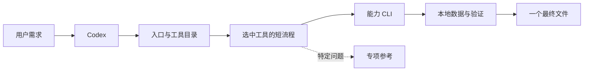

# assistant 架构、路线评估与扩展合同

仅在架构评估、新增能力或共享合同变化时读取。它是根 AGENTS.md 的延伸约束；日常使用只读目标工具的 guide。

## 决策

保留 **Codex 做语义判断 + 本地脚本执行确定性工作**。项目命名 `assistant`，GitHub 仓库命名 `codex-assistant`。`catalog` 用于既有 XLSX 图册；`pool` 负责持续、多格式、语义标签与交互选品，共用同一检索和 PPT 引擎。产品能力源码集中在 `catalog_tool/`。

| 方案 | 适用与取舍 |
| --- | --- |
| 薄入口 + 能力登记 + 按需指南（采用） | 复用既有 CLI，发现无需业务依赖；能力可独立演进，新增工具只加一条登记 |
| 只改 README、继续散放脚本 | 改动少，但能力增多后难发现、难限定读取范围 |
| 中央 agent 服务 / 全量插件框架 | 当前没有独立模型服务、远程调用或常驻 UI 的需求；增加部署、权限和维护成本。实际出现此类需求后再加适配层 |

## XLSX → PPT 路线评估（2026-09-29）

| 环节 | 现有证据与判断 | 边界 / 处理 |
| --- | --- | --- |
| 格式接入 | 有界观察 + 坐标映射；行表、合并、同表分段共用投影；重复卡片有合成测试 | 首次陌生布局仍需 Codex 识别语义。新增格式不应继续堆表头别名或厂家分支；遇覆盖缺口修通用合同 |
| 事实准确性 | 保留缓存原值、价格角色、原列、坐标、源哈希与图片哈希；发布前复核 | 可证明“输出来自这些单元格”，不能证明报价或源图内容本身正确。公式无缓存、Excel 错误、复杂组合价不能猜算 |
| 检索 | SQLite FTS5 字符索引 + 原文核对；证据资料补齐、等价叫法、多路有界检索和覆盖提示 | Codex 区分硬条件与偏好；所有路线共用硬条件。来源版本/同款分组须有明确核对记录，未知日期不冒充最新。一次 retrieve 共用来源新鲜度检查，跨次重新检查；合同见 [产品资料与检索](POOL_RETRIEVAL.md) |
| Token | 小候选 → 字段投影 → 字符窗口；完整说明直接送入生成器 | 默认上下文曾被产品专用根规则占用；现改为能力路由。不要以全文 dump 或全代理复制历史替代检索 |
| PPT | 源图、可编辑文字、完整说明续页、备注溯源；验证成功才替换最终文件 | 当前是产品图册模板，不能宣称任意 PPT 设计器。机器验证之外仍要看长名称、中文字体、图文对应与实际阅读效果 |
| 图片与价格 | WPS 单元格图与浮动 PNG/JPEG；角色化多价格；未知值不参与预算 | Excel 原生富数据图、外链图尚未完整支持。组合价单位与规格关系应先明确数据合同，再适配，禁止估算 |
| 迁移与部署 | 原先入口偏向固定 Codex 路径，索引含绝对路径 | 统一 Python 选择、允许运行时覆盖；迁移显式校验哈希与映射并重建受影响来源，旧 ID 作废。没有偷偷改 JSON 路径 |
| 隐私与维护 | 私有数据隔离；公开检查覆盖已跟踪文件和可达历史 | PPT 备注包含来源文件名/表名/坐标，交付前按客户要求核对。定向扫描不是任意商业敏感信息的证明 |

此前本机记录：10 个工作簿 / 43 张表 / 2524 条记录；30 次检索中位数约 11ms，5 款 / 6 页 PPT 生成与核验约 4.3s。它们是已记录样本，不能当作所有设备的承诺；不含首次语义判断和 Codex 推理。详细方法、核验范围与限制见 catalog 参考第 5 节。

**结论：**日常选品继续沿用现路线。优先让接入结构可复用、证据可核对、输出可控。新输入能力必须能说明记录粒度、单位和字段来源；新模板复用同一选品与验证数据，不能复制第二套解析器。

## 共享边界

- `assistant.py` 只负责发现和分发：`list`（默认 10、最多 50、query/offset）、`describe ID`（只返回登记）、`run ID ...`（保留参数与失败状态）、`doctor`（只检查入口）。不导入工具模块、不读业务数据、不猜路由。
- `tools.json` 是唯一能力目录：`version:1`；每项只含 `id/summary/tags/entrypoint/guide`。summary 最多 160 字符、tags 最多 12 项；路径必须指向项目内文件。
- 入口以项目为 cwd，用当前 Python 启动登记的 CLI，不拼 shell 字符串。其他语言通过能力自己的 Python 薄适配器调用。返回退出码和有界结果；完整文件留在本地。
- `catalog.py ppt` 仅通过 JSON 数据参数调用已有 `run.ps1`，后者仍唯一负责暂存、构建、校验和替换；不再实现一套 PPT 管线。
- `pool` 用原件哈希和记录定位保存长期产品，不依赖上传文件继续存在；选择页只保存选中项，语义判断仍由 Codex 承担。新增数据管理合同见 [产品池](PRODUCT_POOL.md)。
- `scripts/audit_public.py` 是共享发布检查；业务能力不拥有仓库发布语义。历史命令保留兼容入口。

## 渐进式披露合同

1. 根 AGENTS：常驻路由、事实边界、隐私、分工门禁；不放全部工具手册或模型/技能目录。
2. 工具目录：按关键词只返回简短候选；Codex 选中后 `describe`，读取一个 `guide`。
3. 工具 guide：高频命令、停止条件、专项文档触发条件。多步任务在这里写流程，不让根路由理解业务。
4. 参考 / 源码 / 技能：仅在明确参数、适配、异常或开发需求时读相应章节。日志、Base64、全库原文不进入主上下文。

能力增长时仍保持这四层；增加结果分页和摘要，不在根文档列举所有实现。只扩展共享层里已出现的重复需求。

## 接入新工具

1. 在独立目录写 CLI 和短 guide（建议 `tools/<id>/`）；复用已有共用 helper，不复制业务管线。声明输入、输出、依赖、修改哪些状态、失败处理和最终交付。
2. 在 `tools.json` 登记一句摘要、用户常用关键词、Python 入口和 guide。根入口无需增加分支；未实现的能力不能登记为可用。
3. 私有状态放 `.local.json` 或明确忽略的目录。新增缓存目录同时更新 `.gitignore` 与公开检查；真业务内容不作公开测试夹具。
4. 有界 stdout、明确错误退出码；外部副作用遵守用户授权，不能因为被登记为工具就自动获得发送/发布权限。
5. 测关键合同与失败路径，再更新 CI 对应能力的检查。检索类测边界/原值/新鲜度；产出类测失败保留旧结果。需要本机运行时的验证单列，不能让 CI 的核心通过冒充完整验收。

本轮改造顺序：入口合同测试 → 薄路由和产品适配 → 迁移事务测试 → 本地索引恢复 → 完整回归与生成冒烟 → 私有数据检查 → 同步代码。未来只有真实任务命中才扩展其他能力。
