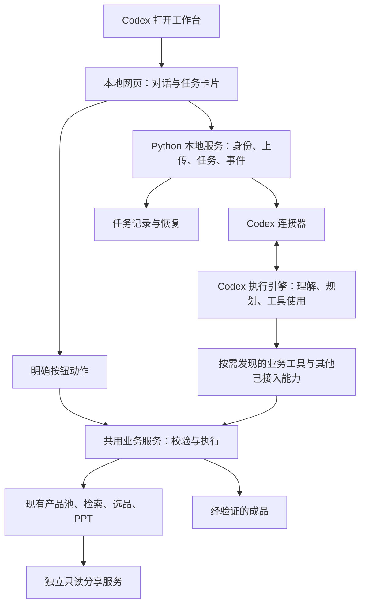

# assistant 本地工作台：可行性、价值与设计草案

日期：2026-10-02。状态：设计基线；0.4 文字与图文工作台已实现，实测范围、变更与可选延后项见实施计划的“实施记录”。

实施计划：[网页交流工作台](../plans/2026-10-02-local-workspace-plan.md)。新增要求：网页作为有温度、图文并茂、可直接操作的沟通媒介；语音作为可选增强。

已确认范围：每位用户在自己的 Windows 电脑使用，产品资料留在本机；暂不做多人共库。用户希望所有日常交互在网页内完成，同时保留 Codex 的通用办事能力。正常 / 低消耗档、普通速度、来源准确、最终只交付一份业务成品的原则继续保留。

## 1. 建议与价值判断

**建议做“本地对话工作台”：聊天为主，商品选择、文件和进度按任务出现；后端连接 Codex 执行引擎，复用现有确定性工具。先验证连接与能力，再建设完整界面。**

| 方向 | 对用户的价值 | Token 收益 | 维护成本 | 判断 |
| --- | --- | --- | --- | --- |
| 保持原生 Codex，增强旁边的业务页面 | 能快速减少选择、导出等步骤 | 部分固定操作可绕过推理 | 较低，宿主能力保持现状 | 最小投入的参照方案，保留为现有入口 |
| 本地网页承接聊天和业务操作，连接 Codex | 不必在聊天与选品页间来回切换；可持续增加其他能力 | 有优化空间，必须实测 | 中等偏高，要维护会话、工具接入和恢复 | 推荐目标，须通过能力验证 |
| 做完整 Windows 桌面软件，重做代理体系 | 可深度定制窗口和系统集成 | 打包形式本身没有收益 | 高，增加安装、签名、更新与适配链 | 当前不采用；以后有需要可加轻启动器 |

价值排序：**降低学习成本和出错率 > 简化重复工作 > 节省 token > 改变软件包装。**

仅把聊天换个皮肤，收益有限。把现有流程中明确的操作交给程序，同时让 Codex 继续理解开放需求，才有持续价值。若独立网页缺少关键宿主能力，优先保留原生 Codex 的使用体验，不为“必须是网站”复制整套宿主。

## 2. 本次核实了什么

### 当前项目

核查版本：`0b84d11ea20c1565a8aa13abbfcd0759b0c539dc`。

| 现有部分 | 可复用程度 | 网站化需要补的部分 |
| --- | --- | --- |
| `assistant.py`、`tools.json` | 保留能力发现与渐进式指南；现仅登记 pool / catalog | 增加工作台入口。当前登记只有 CLI 路径，不能直接当完整网页 API schema |
| `pool_store.py`、检索与资料模块 | 保留内容哈希、证据、报价角色、增量入库和有界检索 | 面向长驻服务的连接生命周期、统一写入入口、任务进度 |
| `pool_selection.py` | 保留冻结候选、修订号、已选记录及来源核验 | 将明确的选品 / 导出动作接入页面，并处理请求重试与任务关联 |
| `pool_select.html` | 复用卡片、折叠、大字和局部更新经验 | 目前只有选择与分享，没有聊天、上传、通用任务、成品列表 |
| `pool_server.py` | 可参考现有访问边界，旧入口先保持兼容 | 当前是单会话 HTTPServer，端点刻意有限，不能直接扩成代理网关；CSP 也禁止 iframe 嵌入 |
| `present.py`、`run.ps1` | 复用原图原价、暂存、验证与成品替换 | 网页任务使用独立输出路径，避免不同任务覆盖同一个下载文件 |
| Windows 安装包 | 复用独立环境、哈希校验和部署验收 | 加入前端静态产物及运行时探测；升级和任务恢复仍需验证 |

现有 SQLite 连接在构造时建立，默认不允许随意跨线程共享。不能把一个 Pool 对象直接交给所有异步请求，也不能通过关闭线程检查来代替并发设计。当前多数命令按短进程执行，网站化是执行生命周期的变化，不是仅添加几个页面。

### Codex 接口

本机 CLI 为 `0.130.0-alpha.5`，已读取帮助并生成其 JSON Schema，确认有会话、回合、暂停、追问、审批、模型列表及 token 用量事件。本次**没有运行模型回合、没有验证桌面工具继承、没有获得网页端实际节省数据**。

官方将 App Server 用于自定义客户端，提供会话与事件接口；文档也标注实验性边界，尤其 WebSocket 和动态工具。设计采用本机后端连接 stdio，不让浏览器直连 App Server。[App Server 文档](https://learn.chatgpt.com/docs/app-server)

官方 Python SDK 提供同步 / 异步本地控制和固定运行时依赖。连接器优先评估官方 SDK；P0 必须确认所选版本能处理需要的事件和审批。若不足，明确选择一个小型 stdio 协议适配器，不在运行时悄悄切另一套执行链。[Codex SDK 文档](https://learn.chatgpt.com/docs/codex-sdk)

账号由本机 Codex 的正式登录流程管理，连接器核验实际登录方式与模型权限；不读取、复制或向网页暴露账号令牌，不静默改用另外收费的 API key。[登录文档](https://learn.chatgpt.com/docs/auth)

### Phoebe 的参考范围

通过用户账户读取了 Phoebe 远端主线 `f51dc818c2855c62412670a26f37323c4e806797` 的架构与开发约束；本地 checkout 较旧，没有把它当最新实现。这里只吸收通用设计经验，不复制私有代码或其业务配置。

值得借鉴：前端 / 服务 / 执行器分层；一个业务状态真值；按钮和代理共用执行服务；局部更新保留焦点和滚动；按需加载能力；用真实结果判定完成。

不照搬：专用领域的多层代理、意图路由器、重复评审环、领域任务树以及远程控制体系。这些没有解决本项目眼前的使用问题，反而可能增加提示词、调用次数和恢复难度。[参考仓库（需访问权限）](https://github.com/GuoLuPM-Labs/Phoebe)

## 3. 用户眼中的样子

默认页面像一个简洁的聊天助手。主界面只有“新办一件事”、最近任务和聊天输入；资料、历史成品、档位与帮助收在次级入口，不做密集管理后台。

```text
┌ 最近办的事 ┬──────────────────────────────────────┐
│ 新办一件事 │ 今天想让我帮您做什么？                 │
│            │                                      │
│ 新年礼品   │ 用户：找一百以内，送长辈的礼品。         │
│ 昨天的图册 │ 助手：好，我先帮您找。                 │
│            │                                      │
│            │ [可勾选的商品卡片；详情默认收起]        │
│            │ 已选 3 款             [做成图册]       │
│            │                                      │
│            │ [输入需求……]     [加资料] [发送/停止]  │
└────────────┴──────────────────────────────────────┘
```

- 用户照常说话，不必先选“入库 / 检索 / 智能分析”等模式。问到价格口径等必要信息时，在聊天里呈现一次简短问题或选项。
- “加资料”支持拖放 / 文件选择。重复文件直接告诉用户已存在；未知结构交给 Codex 处理。待处理、部分入库和完成是不同状态。
- 候选直接出现在当前任务中，保留现有大字、图片、价格与展开交互。勾选后点“做成图册”即可，无须切回另一窗口再说“选好了”；愿意用口语也可以。
- 点击导出只执行既定选择和价格，不唤起模型重新选品；空选择、旧修订、来源变化通过原校验反馈，不能放宽条件继续生成。
- 结果显示一张成品卡片：文件名、打开 / 保存。内部 JSON、日志和临时文件不交给用户。
- 做其他事情时仍用同一个输入框。文档、文件整理等任务按实际可用工具进行，不把所有需求强制套进商品流程。
- 22px 为正文起点，主要点击目标至少 44px；不依赖 hover 才能操作。不用整页刷新或不断弹出提示打断用户；保留滚动、输入内容和勾选。
- 帮助按当前问题展开，一次讲下一步。停止按钮中止当前工作；明确说明已完成的操作不会因此自动撤销。

### 3.1 网页作为交流媒介

首版组合自然语言、真实图片、选择卡片、简短对比、真实进度和成品预览。展示形式按当前信息选择：需要用户判断就给简洁选项，比较商品就展示少量差异，处理文件就显示实际处理阶段。用户始终可以自由输入，不必按按钮表达全部需求。

“有温度”体现在理解上下文、措辞自然、等待有交代、遇错给下一步。使用真实状态，不编造百分比、剩余时间或完成结果；不用持续跳动、庆祝动画或拟人化表情占据注意力。来源没有图片时自然排版，不生成商品图片补空。

模型可按需提出结构化展示请求，使用已注册的 block 类型和对象引用；程序负责加载商品事实、报价、附件和允许的操作。富展示不能成为另一套事实真值。模型不直接向主页面注入 HTML、JavaScript 或命令。用户资料中的文字始终作为内容处理。

支持安静模式和减少动效。语音分两层：先评估用户点选后的本机朗读，默认关闭、随时停止；语音输入和连续语音对话后续独立验证，不作为首版前提。朗读直接使用用户眼前的已完成回答，不为了配音再调用一次模型。浏览器区分本地与远程语音服务，不能把所有系统声音都说成离线；无经验证的本地中文声音时保留文字功能并明确说明。[语音服务说明](https://developer.mozilla.org/en-US/docs/Web/API/SpeechSynthesisVoice/localService)

音频由用户主动开启，支持停止；非必要动效遵守减少动态效果偏好。语音不承担唯一提示，也不播放尚未核验或随后可能变更的报价。[音频控制](https://www.w3.org/WAI/WCAG22/Understanding/audio-control.html)、[交互动画](https://www.w3.org/WAI/WCAG22/Understanding/animation-from-interactions.html)

## 4. 推荐架构



### 分工

1. **网页**展示对话、问题、候选、真实进度与成品，发送明确操作。不用模型编写临时网页，不在前端推断业务完成。
2. **工作台服务**管理本地会话、上传、任务关联、事件恢复和进程。它不判断口语含义，不建立新的规划代理。
3. **Codex**理解开放需求、选择能力、判断来源语义、处理新情况。一个任务复用一个主要对话，不给每次按钮点击新建代理。
4. **业务服务**是 UI 与模型共同调用的执行入口，独立检查价格、来源、修订、权限与副作用。不信任模型的“已完成”文字。

技术建议：前端采用 React + TypeScript，Vite 构建成静态文件；Python 使用 FastAPI / ASGI 承接 HTTP 和事件流，复用既有 Python 模块。发行包携带前端构建结果，用户不需要安装前端开发环境。依赖在实施时固定版本与许可证；不用 SSR、Redis、微服务或另起 Node 后端。[React 状态说明](https://react.dev/learn/preserving-and-resetting-state)、[Vite 构建说明](https://vite.dev/guide/build.html)、[FastAPI 异步说明](https://fastapi.tiangolo.com/async/)

网页到工作台使用同源 HTTP + SSE，明确操作用 POST；工作台到 Codex 用 stdio。SSE 断开只代表页面连接断开，不能判任务失败或重新执行；它不是模型上下文的传输通道。

### 接入已有能力

- 先把 CLI 内的参数和业务编排收进小型服务函数，CLI、网页和模型工具适配器共同调用，不复制解析器、检索器或 PPT 生成器。
- `tools.json` 继续作为能力目录；不要静默改变现有字段合同。网页动作的参数 schema、读写性质和结果类型由对应能力维护，通过版本化适配注册接入。
- Codex 侧业务入口优先采用薄 MCP 适配器，按需返回能力合同；这与已删除的旧 `codex mcp-server` 命令无关，是本项目向 Codex 提供工具。App Server 动态工具不是首版必需依赖。
- 只常驻少量发现工具；按任务返回短合同、ID、摘要与来源引用。完整资料和图像保存在文件 / 服务中，有需要再取。
- 通用任务可以使用该运行时实际支持且已经配置的文件、终端、技能、MCP 等能力。保持原有 Codex 工具循环，不额外加一个“总模型 → 路由模型 → 执行模型”。

## 5. 保留“像 Codex 一样办事”的条件

接入同一种模型与继承完整桌面能力是两回事。新客户端需要验证以下清单，不能用“能回一句话”代替验收：

| 能力 | 方案与验收 |
| --- | --- |
| 多轮理解、追问、中途补充与停止 | 对接原生回合事件；回复绑定明确 request / turn ID，过期回答不得送进另一回合 |
| 本机文件与终端 | 按工作范围配置沙箱与审批；用户选入文件成为输入对象，不开放网页任意路径读写接口 |
| 技能 / MCP / 已连接应用 | 读取新运行时实际可见能力并逐项测试，不以桌面已安装推定自动继承 |
| PDF / 表格 / 图片阅读 | 保留来源、图片与坐标；新模型会话验证图像输入和受限文件读取 |
| PPT | 继续用本机已配置 Node、artifact 工具与 Presentations 组件，跑实际输出核验 |
| 浏览器与桌面专有工具 | 单独接入验证。当前宿主提供的开面板、截图、应用连接等工具不承诺自动可用 |
| 新增任务类型 | 通过既有目录、指南和工具扩展；不按用户话术写关键词分支，也不默默改生产脚本来假装支持 |

首版使用独立受管理的 Codex 会话，不附着或抢占正在进行的桌面聊天，不通过私有进程接口操作当前聊天。必要的技能路径、运行时路径与权限由安装阶段建立。能力不足时说清楚；若关键能力必须回桌面才能完成，就不能将“所有交互已网页化”列为验收成功。

通用能力开放与数据写入保护同时存在：模型可在任务工作区操作，经业务工具改正式产品池。对正式库的写入不能只靠提示词约束；实施时验证沙箱能阻止绕过服务写库。扩大文件权限应有真实范围和授权，不默认继承开发机的无限制配置。

## 6. Token 到底能省在哪里

以下是设计预期，不是实测节省比例。

| 操作 | 推荐处理 | 模型参与 |
| --- | --- | --- |
| 展开、勾选、翻页、查看和保存成品 | 页面状态 / 业务 API | 无需模型回合 |
| 从既定勾选生成或重试相同 PPT | 冻结选择 → 核验 → 生成 | 无需重新理解；失败确需分析时才请求帮助 |
| 已支持结构的上传、哈希去重 | 原工具直接执行 | 无需先让模型读整份文件 |
| 明确价格 / 品类筛选 | 显式控件调用查询 | 控件无需推理；自然语言仍交 Codex |
| “适合送长辈，显得有心意” | Codex 区分硬条件与偏好，少量候选核对 | 保留语义推理，不做关键词抢答 |
| 陌生资料、图文错位、复杂报价 | 有界观察、证据核对、明确缺失 | 仍是主要成本，网页不会消除 |
| 新类型任务 | 同一 Codex 引擎按需发现工具 | 不能为了省 token 把通用能力关掉 |

去重、索引、短结果和生成脚本已经存在，不能把它们原本的收益再次算成网站化新增收益。新增收益主要来自减少“回聊天确认 → 再查选择 → 再执行”及重复上下文搬运。

具体约束：

- 完整文件、候选卡片 HTML、逐 token UI 更新不回灌给模型。下一次语义回合只附必要的任务 ID、状态修订、用户新要求和有界摘要。
- 页面直接动作引起状态变化后，服务标记相应修订；下一轮 Codex 看到最新摘要。若模型正在规划，业务执行仍校验修订，不能拿旧勾选继续写入。
- 来源没有变化、字段和提取版本也没有变化时，复用已核验的结构映射与证据；不能只凭文件名缓存。
- 普通任务只用主模型。子代理仅处理独立、范围明确的任务，输入不复制整个主对话。正常用最新可用 Sol / Terra，低消耗用 Terra / Luna，均普通速度。
- 不通过删证据、降验证、限制用户自由表达获得表面节省。低消耗增加重试时也计入总成本。
- 不新建一个永久增长的全能大聊天；任务间保存简短交接和结果引用，实际历史按需读取。

### 衡量办法

用同一份输入、相同模型 / 速度 / 资料状态，比较现流程、增强业务页面、全网页三种路线。至少覆盖：重复文件、陌生异形报价、抽象礼品检索、换一批、改选导出、失败恢复、接着上次，以及一个非产品任务。常见与未参与设计的任务都要有。

记录每个成功任务的总输入、缓存输入、输出、推理量、调用次数、耗时、用户操作次数与错误率；失败和恢复调用计入。用原生 usage 事件按 thread / turn 去重，缺少统计时记未知，不能按文字长度冒充 token 数。不要把已包含在输出中的推理量再次相加；客户端 token 计数也不直接等于订阅额度或固定费用。

首版硬目标：确定性点击不触发模型回合，结果正确性与原流程相同，用户不必为产品主流程来回切换聊天窗口。只有对照结果显示实际收益，才扩大重构范围；现在不承诺“省一半”等数字。

## 7. 数据、任务与恢复

- 产品与选择继续以现有业务数据库为真值；工作台记录 task / Codex thread 关联、作业状态、输入对象和成品引用。对话只是解释与历史，不反向改写业务事实。
- 每个池统一写入队列，由同一个服务 owner 调用领域方法。连接在其所属 worker 中创建与关闭；解析 / 模型 / PPT 等长操作不能占住写事务或阻塞事件循环。
- 工作台运行时，网页、模型工具及旧 CLI 的写操作都进入相同服务；脱机维护是明确模式。不能让 CLI 或旧选择服务绕过写入队列，锁异常要显式恢复，不偷偷转成直写。
- 导入、创建选择、生成任务带幂等请求 ID。业务效果与回执在同一事务提交；跨数据库任务状态不能假装原子，恢复时依据业务回执对账，不盲目重发。
- 页面动作保留乐观并发修订。生成前等待最后一次勾选保存，校验当前选择；双击生成只创建一个工作。
- 每个任务有独立暂存与产出位置，沿用现有可指定 output 的生成器。验证成功后发布成品引用和哈希；失败保留旧成品。每项任务只向用户交付一份最终文件。
- Codex 回合结束不等于产品工作完成；来源核验、生成器结果和文件校验共同产生完成回执。流断、超时或进程退出也不等于成功。
- 事件有序号，刷新后先读实际状态再补事件。关闭浏览器不重新执行任务；服务异常后把未核验工作标为中断，按原回执和产物核对是否可继续。
- 选择一旦 sealed，重试导出可复用原勾选但仍核验；改选建立新会话，不修改历史快照。人工关闭的会话不自动重开。

## 8. “只能由 Codex 打开”与分享

可以做到的产品约束：由 Codex 运行启动命令，服务只监听 loopback，发出短时一次性启动凭据，换取本地 HttpOnly / SameSite 会话；新开网页需有效本地会话。凭据不落访问日志，不把 OpenAI 凭据交给浏览器。

不能据此声称：密码学上证明来访浏览器一定是 Codex 内置浏览器。User-Agent、Referer 和普通 URL 都不足以证明这一点；得到同一凭据的其他本机浏览器仍可能访问。**建议约定“从 Codex 启动并授权”，不投入成本伪装浏览器专属限制。**

后端检查 Host、Origin、会话和操作权限，文件由受控 ID 解析；上传以内容哈希归档并检查大小、类型和解压限制，模型提示中的文字不能授予额外权限。网页不提供任意 shell / 任意文件路径代理。

临时分享继续走独立、仅允许公开字段的只读服务。产品池、聊天、上传、账号、Codex 执行 API 均不接隧道。保留当前由用户确认分享、电脑开机联网和只分享候选快照的合同。

本地网页无需域名、公网 IP 或中心服务器。数据存本机不代表模型在本机推理；自然语言处理仍受 Codex 登录、联网与额度影响。断网可保留已支持的本地查看 / 检索 / 生成能力，并明确哪些操作需要模型恢复。

## 9. 实施顺序与停止条件

### P0：先验证保留能力是否可行

在独立测试目录做最小连接，不改正式库。验证登录、可用模型、中文流式对话、追问、停止、断开后恢复、技能 / 工具可见性、真实图片输入和一个受控文件操作。接现有工具完成合成产品入库 → 用户勾选 → 实际 PPT 导出，同时做一个非产品任务。

固定并记录受验 CLI / SDK 版本；不要直接把本机 alpha 版本当发行承诺。审批与 user-input 等字段需要按实际 schema 区分稳定 / 实验性，未知请求返回明确失败，不能无声等待或自动批准。

**通过条件：**上述关键能力可经拟用连接器完成，实际产物准确，进程能清理，会话恢复不重复执行。完整网页中的刷新恢复与用户操作由 P1 再验收，不能用连接器检查代替。若主要工具只能依赖原桌面宿主且没有可维护接入方式，就重新评估保留原生聊天，不继续堆模拟插件或私有接口。

### P1：交付一个最小但完整的本地工作台

聊天、文件加入、候选卡片、做成图册、最近任务、成品、帮助。页面采用事件驱动局部更新；原 Codex / CLI 入口保留，共用业务执行。接入实际 token 统计，记录与原流程的对照数据。

必要验收包括：重复上传不重复入库；部分导入不称完成；预算与价格角色不混；勾选无闪烁且刷新保留；旧修订拒绝；双击不重复；取消不自动重跑；失败保留旧文件；只读分享不暴露工作台；200% 字体、键盘与窄屏可用。

### P2：按真实需求扩展

用至少一个与选品无关的能力检验“通用工作台”设计。新增能力只增加对应工具、合同与展示器，不复制聊天 / 审批 / 存储体系。按需要完善升级、迁移与恢复；实际需要桌面快捷启动时再加轻启动器。多人共库、公网执行、多代理控制台暂不建设。

## 10. 最终判断

**用户体验价值高，token 收益有条件，完整替代 Codex 桌面的成本高。**

建议投入顺序是：连接与能力验证 → 一条完整的网页产品工作流 → 实测正确率、操作数和 token → 再扩展通用能力。现有代码应作为业务内核保留；新代码集中在界面、连接器和可恢复任务服务。

本次只形成可评审方案。生产程序、真实产品池、正在使用的选择服务及公开 Release 均未变更。
